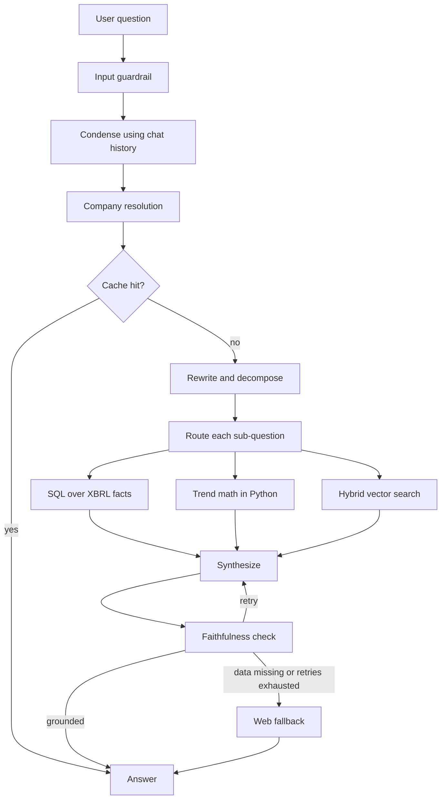

# FilingsIQ

A question-answering agent over SEC 10-K filings for ten companies (AAPL, JPM, XOM, PFE, WMT, PLD, CAT, MET, MS, TSLA). Ask it for a number ("What was Apple's revenue in FY2025?") or for narrative ("How does ExxonMobil justify its oil and gas investment despite climate risk?") and it routes the question to the right data source, answers only from what it retrieved, and checks its own answer before returning it.

Built with LangGraph, FastAPI, SQLite, Chroma, Redis, OpenTelemetry and Arize Phoenix. Runs locally with Docker Compose.

## How it works

Every filing is ingested twice:

- **Structured facts.** The iXBRL tags in each filing (revenue, net income, shares outstanding, and so on) are extracted into `facts.sqlite`. Numbers come from here, so they are exact and never paraphrased by a model.
- **Prose.** The narrative sections (risk factors, MD&A, notes) are chunked, embedded with `all-mpnet-base-v2`, and stored in a Chroma collection for hybrid search (BM25 plus dense vectors, merged with reciprocal rank fusion).



### Design decisions worth knowing about

- **Numbers come from SQL, not from a model.** Trend and growth calculations are done in Python and labelled as such in the context the model sees. The synthesis prompt forbids estimating or recomputing figures.
- **Failures carry a status.** Each retrieval step reports `ok`, `retryable_failure` or `permanent_failure`. A permanent failure (for example, a fiscal year that isn't in the filing) skips the retry loop and goes straight to web fallback instead of retrying something that cannot change.
- **A faithfulness check is not enough on its own.** An honest "the data doesn't contain this" scores as fully faithful, so the guardrail also detects graceful declines and treats them as a reason to retry rather than accept.
- **Router overrides were measured, not assumed.** The question classifier sometimes calls a figure question "narrative". A keyword-based override corrects that, but on the golden set an ungated version flipped 20 of 23 correct narrative questions to SQL, so it is gated on figure-request wording. The tradeoff (a few SQL questions are no longer rescued) is documented in the code.
- **Caching is exact-match on purpose.** A similarity cache can't tell "same question, different words" from "different year, similar words", and a silently wrong-year answer is worse than a cache miss. Thumbs-down in the UI deletes the cached answer.
- **Refusals.** Requests for moral verdicts or for undisclosed motives are declined early, before any retrieval.
- **Conversation memory.** A dedicated step rewrites follow-ups ("how about their gross margin?") into standalone questions using numbered prior turns, before company resolution, caching and routing see them.

## Tech stack

| Area | Tools |
|---|---|
| Orchestration | LangGraph, LangChain, OpenAI (`gpt-4o-mini`) |
| Retrieval | SQLite (XBRL facts), Chroma + `all-mpnet-base-v2`, BM25 (`rank-bm25`) |
| API and UI | FastAPI, a single static HTML page |
| Cache | Redis, exact-match with TTL |
| Observability | OpenTelemetry, Arize Phoenix (self-hosted), JSONL audit log |
| Web fallback | Tavily |
| Packaging | Docker, Docker Compose |

## Quickstart (Docker)

```bash
git clone git@github.com:vishnu1234-123/filingsiq-v2.git
cd filingsiq-v2
cp .env.example .env        # then add OPENAI_API_KEY and TAVILY_API_KEY
# put the ingested data in ./data (see "Data" below)
docker compose up --build
```

- App: http://localhost:8000
- Phoenix (traces): http://localhost:6006

The first start downloads the embedding model from Hugging Face, so give it a minute before the page responds. If a port is already taken (Phoenix uses 4317 and 6006, Redis 6379, the app 8000), stop whatever is holding it first.

### Data

`data/` is not committed (the Chroma store and SQLite file are large and regenerable). It must contain:

- `data/facts.sqlite`, the extracted XBRL facts
- `data/chroma_store/`, the Chroma collection `filing_chunks_mpnet`

Both are produced by the ingestion pipeline in `ingestion/` from the filings in `data/raw/`.

<!-- TODO: add the exact ingestion commands here -->

### Running without Docker

```bash
pip install -r requirements.txt
# start Redis locally, then:
export OPENAI_API_KEY=... TAVILY_API_KEY=...
uvicorn api.main:app --reload
```

## API

| Method | Path | Purpose |
|---|---|---|
| POST | `/ask` | Ask a question. Send `session_id` back to continue a conversation. |
| POST | `/feedback` | Thumbs up/down. Thumbs-down deletes that answer from the cache. |
| GET | `/companies` | The ten supported companies. |
| GET | `/session/{id}` | Inspect a session's stored history. |
| GET | `/health` | Liveness check. |

```bash
curl -X POST http://localhost:8000/ask \
  -H "Content-Type: application/json" \
  -d '{"question": "What was Apple'"'"'s revenue in FY2025?"}'
```

## Observability

Every question produces one nested trace: a span per graph node and one per LLM call, with prompts, completions, token counts and cost. Traces export over OTLP to Phoenix. Business decisions (blocked queries, retries, cache hits, web fallbacks, thumbs-down events) are written separately to `data/audit_log.jsonl`. This split is deliberate: traces are for performance and debugging, the audit log is for answering "why did the system do that" later.

Set `OTEL_QUIET=true` to silence console exporters during local runs.

## Evaluation

A golden set of 60 questions (`eval/golden_set_core.json`) covers SQL lookups, narrative questions, multi-part analytical questions, contradiction reconciliation and questions that should be declined. Last full run, using `gpt-4o-mini`:

| Category | n | Correct |
|---|---|---|
| SQL lookups | 24 | 95.8% |
| Narrative (vector) | 23 | 91.3% |
| Analytical synthesis | 6 | 66.7% |
| Contradiction reconciliation | 3 | 66.7% |
| Should decline | 4 | 100% |
| **Overall** | **60** | **90.0%** |

The analytical and contradiction categories are too small for those percentages to mean much. Several fixes landed after this run (fiscal-year filtering, routing gate changes, conversation memory) and the full eval has not been re-run since.

## Tests

```bash
OTEL_QUIET=true pytest tests/ -v
```

The unit tests mock the LLM and the cache, so they need no API keys or running services.

## Known limitations

- **Sessions are held in memory.** Conversation history lives in a Python dict in the API process, so it is lost on restart and won't work with more than one worker or container. It needs a shared store such as Redis.
- **Pronoun resolution can pick the wrong turn.** A follow-up like "how does that compare to their revenue?" can bind to an earlier company when the most recent turn never mentioned the metric.
- **Concept selection can miss.** SQL answers depend on picking the right XBRL concept from a shortlist. For some phrasings the right concept is ranked out of the shortlist or the model returns NONE, which falls back to vector search and costs extra retries.
- **Web answers are unverified.** When the filing has no data (for example, an older fiscal year), the answer comes from Tavily search results and is labelled as not verified against the filing.
- **Limited coverage.** Ten companies, one filing each, typically three fiscal years of structured data.
- **Company names are matched against a fixed list** with light typo tolerance, so uncommon spellings or nicknames may be rejected.
- **DuckDuckGo fallback is not installed** in the Docker image, so Tavily is the only working web search.

## Status

- Done: ingestion, agent, evaluation, FastAPI, web UI, tracing, Docker Compose.
- Planned: GitHub Actions CI (tests and image build), AWS deployment.

## Project layout

```
api/            FastAPI app and session handling
static/         Single-page UI
orchestration/  Router graph, query preprocessing, concept resolver,
                entity resolution, cache, telemetry
eval/           Retrieval, scoring, and the golden sets
ingestion/      Filing parsing, chunking, embedding
tests/          Unit tests
Dockerfile, docker-compose.yml, requirements.txt
```